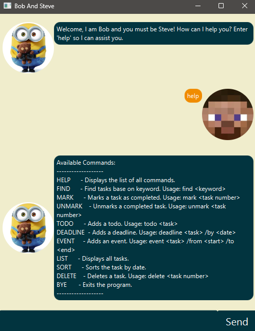

# Bob and Steve Chat box User Guide



Welcome to bob and steve the **CLI Chat box**! This command-line application helps you manage tasks through a variety of commands. Whether you're adding todos, deadlines, or events, this guide will show you how to use each command along with sample outputs.

# Table of Contents

- [Overview](#overview)
- [Available Commands](#available-commands)
- [Command Demonstrations](#command-demonstrations)

# Overview

The CLI chat box is designed to help you efficiently manage your daily tasks. It supports adding new tasks, marking tasks as complete, sorting by dates, and more—all from the terminal.

# Available Commands

```plaintext
Available Commands:
HELP      - Displays the list of all commands.
FIND      - Find tasks based on keyword. Usage: find <keyword>
MARK      - Marks a task as completed. Usage: mark <task number>
UNMARK    - Unmarks a completed task. Usage: unmark <task number>
TODO      - Adds a todo. Usage: todo <task>
DEADLINE  - Adds a deadline. Usage: deadline <task> /by <date>
EVENT     - Adds an event. Usage: event <task> /from <start> /to <end>
LIST      - Displays all tasks.
SORT      - Sorts the tasks by date.
DELETE    - Deletes a task. Usage: delete <task number>
BYE       - Exits the program.
```
# Command Demonstrations

## Adding a todo task: ```todo <task>```
### Creates a task and add it to the list.
Example: `todo borrow bookk`

Expected output:
```
Got it. I've added this task:
[T][ ] borrow book
Now you have 1 tasks in the list.
```

## Marking a task as done: ```mark <task index>```
### Mark a task in the task list as done.
Example: `mark 1`

Expected output:
```
Nice! I've marked this task as done:
[T][X] borrow book
```

## Unmarking a task as not done: ```mark <task index>```
### Unmark a task in the task list as not done.
Example: `unmark 1`

Expected output:
```
OK, I've marked this task as not done yet:
[T][ ] borrow book
```
## Adding a deadline task: ```deadline <task> /by <date>```
### Creates a deadline task and add it to the list.
Example: `deadline Submit report /by 2025-04-01 10:30`

Expected output:
```
Got it. I've added this task:
[D][] Submit report (by: Apr 1 2025 10:30am)
Now you have 2 tasks in the list.
```
## Adding an event task: ```event <task> /from <start> /to <end>```
### Creates an event task and add it to the list.
Example: `event Team outing /from 2025-05-10 10:30 /to 2025-05-12 10:30`

Expected output:
```
Got it. I've added this task:
[E][] Team outing (from: May 10 2025 10:30am to May 12 2025 10:30am)
Now you have 3 tasks in the list.
```

## Finds task base on keyword: ```find <keyword>```
### Finds all the tasks where they have related keyword.
Example: `find Team`

Expected output:
```
Here are the matching tasks in your list.
1.[T][] borrow book
```

## List tasks ```list```
### List every single tasks that was stored.
Example: `list`

Expected output:
```
Here are the matching tasks in your list.
1.[T][] borrow book
2.[D][] Submit report (by: Apr 1 2025 10:30am)
3.[E][] Team outing (from: May 10 2025 10:30am to May 12 2025 10:30am)
```
## Sorts tasks```sort```
###  Sorts all the tasks by shortest date order.
Example: `sort`

Expected output:
```
Task list is sorted by date
```
## Deletes a task ```delete <task index>```
### Deletes the chosen tasks base on index number.
Example: `delete 3`

Expected output:
```
Noted. I've removed this task:
[T][] borrow book
Now you have 2 tasks in the list.
```

## Bye ```bye```
### Exits the application.
Example: `bye`

Expected output:
```
Bye. Hope to see you again soon!
```
